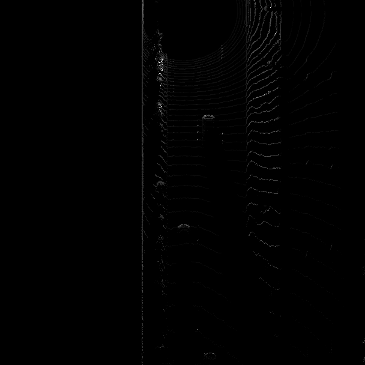

# SDCND : Sensor Fusion and Tracking
This is the project for the second course in the  [Udacity Self-Driving Car Engineer Nanodegree Program](https://www.udacity.com/course/c-plus-plus-nanodegree--nd213) : Sensor Fusion and Tracking. 

In this project, you'll fuse measurements from LiDAR and camera and track vehicles over time. You will be using real-world data from the Waymo Open Dataset, detect objects in 3D point clouds and apply an extended Kalman filter for sensor fusion and tracking.

The project consists of two major parts: 
1. **Object detection**: In this part, a deep-learning approach is used to detect vehicles in LiDAR data based on a birds-eye view perspective of the 3D point-cloud. Also, a series of performance measures is used to evaluate the performance of the detection approach. 
2. **Object tracking** : In this part, an extended Kalman filter is used to track vehicles over time, based on the lidar detections fused with camera detections. Data association and track management are implemented as well.

The following diagram contains an outline of the data flow and of the individual steps that make up the algorithm. 

Also, the project code contains various tasks, which are detailed step-by-step in the code. More information on the algorithm and on the tasks can be found in the Udacity classroom. 

## Project File Structure

📦project 
 ┣ 📂dataset --> contains the Waymo Open Dataset sequences  
 ┃ 
 ┣ 📂misc 
 ┃ ┣ evaluation.py --> plot functions for tracking visualization and RMSE calculation 
 ┃ ┣ helpers.py --> misc. helper functions, e.g. for loading / saving binary files 
 ┃ ┗ objdet_tools.py --> object detection functions without student tasks 
 ┃ ┗ params.py --> parameter file for the tracking part 
 ┃  
 ┣ 📂results --> binary files with pre-computed intermediate results 
 ┃  
 ┣ 📂student  
 ┃ ┣ association.py --> data association logic for assigning measurements to tracks incl. student tasks  
 ┃ ┣ filter.py --> extended Kalman filter implementation incl. student tasks  
 ┃ ┣ measurements.py --> sensor and measurement classes for camera and lidar incl. student tasks  
 ┃ ┣ objdet_detect.py --> model-based object detection incl. student tasks  
 ┃ ┣ objdet_eval.py --> performance assessment for object detection incl. student tasks  
 ┃ ┣ objdet_pcl.py --> point-cloud functions, e.g. for birds-eye view incl. student tasks  
 ┃ ┗ trackmanagement.py --> track and track management classes incl. student tasks   
 ┃  
 ┣ 📂tools --> external tools 
 ┃ ┣ 📂objdet_models --> models for object detection 
 ┃ ┃ ┃ 
 ┃ ┃ ┣ 📂darknet 
 ┃ ┃ ┃ ┣ 📂config 
 ┃ ┃ ┃ ┣ 📂models --> darknet / yolo model class and tools 
 ┃ ┃ ┃ ┣ 📂pretrained --> copy pre-trained model file here 
 ┃ ┃ ┃ ┃ ┗ complex_yolov4_mse_loss.pth 
 ┃ ┃ ┃ ┣ 📂utils --> various helper functions 
 ┃ ┃ ┃ 
 ┃ ┃ ┗ 📂resnet 
 ┃ ┃ ┃ ┣ 📂models --> fpn_resnet model class and tools 
 ┃ ┃ ┃ ┣ 📂pretrained --> copy pre-trained model file here  
 ┃ ┃ ┃ ┃ ┗ fpn_resnet_18_epoch_300.pth  
 ┃ ┃ ┃ ┣ 📂utils --> various helper functions 
 ┃ ┃ ┃ 
 ┃ ┗ 📂waymo_reader --> functions for light-weight loading of Waymo sequences 
 ┃ 
 ┣ basic_loop.py 
 ┣ loop_over_dataset.py 

## Installation Instructions for Running Locally
### Cloning the Project
In order to create a local copy of the project, please click on "Code" and then "Download ZIP". Alternatively, you may of-course use GitHub Desktop or Git Bash for this purpose. 

### Python
The project has been written using Python 3.7. Please make sure that your local installation is equal or above this version. 

### Package Requirements
All dependencies required for the project have been listed in the file `requirements.txt`. You may either install them one-by-one using pip or you can use the following command to install them all at once: 
`pip3 install -r requirements.txt` 

### Waymo Open Dataset Reader
The Waymo Open Dataset Reader is a very convenient toolbox that allows you to access sequences from the Waymo Open Dataset without the need of installing all of the heavy-weight dependencies that come along with the official toolbox. The installation instructions can be found in `tools/waymo_reader/README.md`. 

### Waymo Open Dataset Files
This project makes use of three different sequences to illustrate the concepts of object detection and tracking. These are: 
- Sequence 1 : `training_segment-1005081002024129653_5313_150_5333_150_with_camera_labels.tfrecord`
- Sequence 2 : `training_segment-10072231702153043603_5725_000_5745_000_with_camera_labels.tfrecord`
- Sequence 3 : `training_segment-10963653239323173269_1924_000_1944_000_with_camera_labels.tfrecord`

To download these files, you will have to register with Waymo Open Dataset first: [Open Dataset – Waymo](https://waymo.com/open/terms), if you have not already, making sure to note "Udacity" as your institution.

Once you have done so, please [click here](https://console.cloud.google.com/storage/browser/waymo_open_dataset_v_1_2_0_individual_files) to access the Google Cloud Container that holds all the sequences. Once you have been cleared for access by Waymo (which might take up to 48 hours), you can download the individual sequences. 

The sequences listed above can be found in the folder "training". Please download them and put the `tfrecord`-files into the `dataset` folder of this project.

### Pre-Trained Models
The object detection methods used in this project use pre-trained models which have been provided by the original authors. They can be downloaded [here](https://drive.google.com/file/d/1Pqx7sShlqKSGmvshTYbNDcUEYyZwfn3A/view?usp=sharing) (darknet) and [here](https://drive.google.com/file/d/1RcEfUIF1pzDZco8PJkZ10OL-wLL2usEj/view?usp=sharing) (fpn_resnet). Once downloaded, please copy the model files into the paths `/tools/objdet_models/darknet/pretrained` and `/tools/objdet_models/fpn_resnet/pretrained` respectively.

### Using Pre-Computed Results

In the main file `loop_over_dataset.py`, you can choose which steps of the algorithm should be executed. If you want to call a specific function, you simply need to add the corresponding string literal to one of the following lists: 

- `exec_data` : controls the execution of steps related to sensor data. 
  - `pcl_from_rangeimage` transforms the Waymo Open Data range image into a 3D point-cloud
  - `load_image` returns the image of the front camera

- `exec_detection` : controls which steps of model-based 3D object detection are performed
  - `bev_from_pcl` transforms the point-cloud into a fixed-size birds-eye view perspective
  - `detect_objects` executes the actual detection and returns a set of objects (only vehicles) 
  - `validate_object_labels` decides which ground-truth labels should be considered (e.g. based on difficulty or visibility)
  - `measure_detection_performance` contains methods to evaluate detection performance for a single frame

In case you do not include a specific step into the list, pre-computed binary files will be loaded instead. This enables you to run the algorithm and look at the results even without having implemented anything yet. The pre-computed results for the mid-term project need to be loaded using [this](https://drive.google.com/drive/folders/1-s46dKSrtx8rrNwnObGbly2nO3i4D7r7?usp=sharing) link. Please use the folder `darknet` first. Unzip the file within and put its content into the folder `results`.

- `exec_tracking` : controls the execution of the object tracking algorithm

- `exec_visualization` : controls the visualization of results
  - `show_range_image` displays two LiDAR range image channels (range and intensity)
  - `show_labels_in_image` projects ground-truth boxes into the front camera image
  - `show_objects_and_labels_in_bev` projects detected objects and label boxes into the birds-eye view
  - `show_objects_in_bev_labels_in_camera` displays a stacked view with labels inside the camera image on top and the birds-eye view with detected objects on the bottom
  - `show_tracks` displays the tracking results
  - `show_detection_performance` displays the performance evaluation based on all detected 
  - `make_tracking_movie` renders an output movie of the object tracking results

Even without solving any of the tasks, the project code can be executed. 

The final project uses pre-computed lidar detections in order for all students to have the same input data. If you use the workspace, the data is prepared there already. Otherwise, [download the pre-computed lidar detections](https://drive.google.com/drive/folders/1IkqFGYTF6Fh_d8J3UjQOSNJ2V42UDZpO?usp=sharing) (~1 GB), unzip them and put them in the folder `results`.

## External Dependencies
Parts of this project are based on the following repositories: 
- [Simple Waymo Open Dataset Reader](https://github.com/gdlg/simple-waymo-open-dataset-reader)
- [Super Fast and Accurate 3D Object Detection based on 3D LiDAR Point Clouds](https://github.com/maudzung/SFA3D)
- [Complex-YOLO: Real-time 3D Object Detection on Point Clouds](https://github.com/maudzung/Complex-YOLOv4-Pytorch)

## License
[License](LICENSE.md)

## 3D Object Detection

In this project, at first lidar point cloud is computed from the range image and then visualized, in the second step the Lidar PCL is used to create BEV, intensity map and height map, in the third step BEV map is used to detect 3D objects, in the last step the object detection performance is computed.

The step-by-step explanation of the process and results are shown below.

### Step 1: Compute Lidar Point-Cloud from Range Image

#### Preparation for Visualize range image channels (ID_S1_EX1):
- data_filename = 'training_segment-1005081002024129653_5313_150_5333_150_with_camera_labels.tfrecord' # Sequence 1
- show_only_frames = [0, 1]
- model = 'darknet' # options are 'darknet', 'resnet'
- sequence = "1"
- model_path='darknet' # # options are 'darknet', 'fpn-resnet'
- exec_data = []
- exec_detection = []
- exec_tracking = []
- exec_visualization = ['show_range_image']

The two data channels, i.e., range and intensity, are extracted from the Lidar data. The range image above is mapped onto 8-bit channels of the OpenCV image, it is to make sure no data is lost. 

#### Preparation for Visualize lidar point-cloud (ID_S1_EX2):
- data_filename = 'training_segment-10963653239323173269_1924_000_1944_000_with_camera_labels.tfrecord'
- show_only_frames = [0, 200]
- model = 'darknet' # options are 'darknet', 'resnet'
- sequence = "3"
- model_path='darknet' # # options are 'darknet', 'fpn-resnet'
- exec_data = []
- exec_detection = []
- exec_tracking = []
- exec_visualization = ['show_pcl']

The below images shows the vehicles from varying degree of visibility from Point cloud (PCL). The Open3D library is used, to visualize and feel the nature of the PCL in a 3D viewer.

1. In front view visualization of PCL, on the right side, the car with the trailer moving away can be seen and on the left side, cars lined up in a straight line facing towards can be seen.
The rear bumbper of trailer and the front bumper of left side car be seen as dark blue.

2. In this top view visualization, the bumper of trailer can be seen in green and the rest of the cars hood can be seen in green. 

3. In slight left view visualization, the cars can be seen moving towards and a few cars parked at the nearby station. The car bumper and spoilers can be detected from the image.

4. In this over all top view, the cars hood can be seen in green.

5. In rear view visualization, the cars behind this car can be seen approaching and bumpers in dark blue.

6. In this rear right view visualization, the cars can be seen approaching. The cars hood can be seen in green, the front shield in light blue and the lower in dark blue.

7. In this front right view visualization, the cars can be seen approaching. The cars hood can be seen in green, the front shield in light blue and the lower in dark blue.

Last three images confirm the vehicle location and approach with respect to front and rear bumpers. 

To summarize, most of the car's headlight, front and rear bumper, front and rear windshield, trunk space, trailer, the hood can be seen from stabilized images.

### Step 2: Create Birds-Eye View from Lidar PCL

#### Preparation for Convert sensor coordinates to BEV-map coordinates (ID_S2_EX1):
- data_filename = 'training_segment-1005081002024129653_5313_150_5333_150_with_camera_labels.tfrecord
- show_only_frames = [0, 1]
- model = 'darknet' # options are 'darknet', 'resnet'
- sequence = "1"
- model_path='darknet' # # options are 'darknet', 'fpn-resnet'
- exec_data = ['pcl_from_rangeimage']
- exec_detection = ['bev_from_pcl']
- exec_tracking = []
- exec_visualization = []

In this task, the sensor coordinates are converted to BEV map coordinates, to obtain a BEV map containing the actual Lidar data from PCL. From the visualization, two cars in front can be easily identified, and the rest can be identified with difficulty.

#### Preparation for Compute intensity layer of the BEV map (ID_S2_EX2):
Similar to above (ID_S2_EX1).

In this task, the BEV map coordinates of all points are identified and the intensity channel of the topmost lidar PCL is assigned to the BEV map and then the intensity image is normalized using percentile to outline the dark and bright region.

#### Preparation for Compute height layer of the BEV map (ID_S2_EX3):
Similar to above (ID_S2_EX1).

In this task, to fill the height channel of the lidar data from PCL, sort is used to the previous task, and height is normalized.

## Step 3: Model-based Object Detection in BEV Image

#### Preparation for Add a second model from a GitHub repo (ID_S3_EX1):
- data_filename = 'training_segment-1005081002024129653_5313_150_5333_150_with_camera_labels.tfrecord
- show_only_frames = [50, 51]
- model = 'resnet' # options are 'darknet', 'resnet'
- sequence = "1"
- model_path='fpn-resnet' # # options are 'darknet', 'fpn-resnet'
- exec_data = ['pcl_from_rangeimage', 'load_image']
- exec_detection = ['bev_from_pcl', 'detect_objects']
- exec_tracking = []
- exec_visualization = ['show_objects_in_bev_labels_in_camera']
- configs_det = det.load_configs(model_name="fpn_resnet")

##### Note: Comment out line 144, 175, 196 & 197 from student_pcl file to get the desired output.

The content of detection before next task. 

#### Preparation for Extract 3D bounding boxes from model response (ID_S3_EX2):

In this task, the detections needs to be converted into metric coordinates in vehicle space. The convertion format is in the form [1, x, y, z, h, w, l, yaw], where 1 denotes the class id for the object type vehicle.

## Step 4: Performance Evaluation for Object Detection

#### Preparation for Compute intersection-over-union between labels and detections (ID_S4_EX1):
- data_filename = 'training_segment-1005081002024129653_5313_150_5333_150_with_camera_labels.tfrecord
- show_only_frames = [50, 51]
- model = 'darknet' # options are 'darknet', 'resnet'
- sequence = "1"
- model_path='darknet' # # options are 'darknet', 'fpn-resnet'
- exec_data = ['pcl_from_rangeimage']
- exec_detection = ['bev_from_pcl', 'detect_objects', 'validate_object_labels', 'measure_detection_performance']
- exec_tracking = []
- exec_visualization = ['show_detection_performance']
- configs_det = det.load_configs(model_name="darknet")

In this task, the detections and the ground truth table are compared to check if any object has been (a) missed (false negative), (b) successfully detected (true positive) or (c) has been falsely reported (false positive). 

#### Preparation for Compute precision and recall (ID_S4_EX3)
- data_filename = 'training_segment-1005081002024129653_5313_150_5333_150_with_camera_labels.tfrecord
- show_only_frames = [50, 150]
- exec_data = ['pcl_from_rangeimage']
- exec_detection = ['bev_from_pcl', 'detect_objects', 'validate_object_labels', 'measure_detection_performance']
- exec_tracking = []
- exec_visualization = ['show_detection_performance']
- configs_det = det.load_configs(model_name="darknet")

In this task, the frames are processed by an evaluation algorithm one by one to evaluate the recall and precision.

In the next step, configs_det.use_labels_as_objects is set to True. It will make sure the algorithm is working as desired.

